# TFL & Weather Pipeline

Batch data pipeline that ingests London Tube status data from the [TfL API](https://api.tfl.gov.uk) and weather forecasts from [Open-Meteo](https://open-meteo.com), processes them through a medallion architecture (Bronze → Silver → Gold), and is designed to power ML models for predicting TfL disruptions based on weather conditions.

## Architecture

```mermaid
flowchart LR
    subgraph Sources["Data Sources"]
        TfL["TfL API<br/>Line Status + Disruptions"]
        Weather["Open-Meteo API<br/>Hourly Forecast"]
    end

    subgraph Ingestion["Ingestion Layer (Airflow)"]
        TfL_DAG["tfl_ingestion_dag<br/>(hourly)"]
        Weather_DAG["weather_ingestion_dag<br/>(hourly)"]
    end

    subgraph Bronze["Bronze Layer (LocalStack S3)"]
        Bronze_TfL["tfl-weather-bronze<br/>├── tfl/line_status/<br/>├── tfl/disruptions/"]
        Bronze_Weather["tfl-weather-bronze<br/>└── weather/forecast/"]
    end

    subgraph Silver["Silver Layer (Spark)"]
        Spark["spark_bronze_to_silver_dag<br/>(hourly, after ingestion)"]
        Silver_TfL["tfl-weather-silver<br/>├── tfl_line_status/<br/>│   └── *.parquet"]
        Silver_Weather["tfl-weather-silver<br/>└── weather_hourly/<br/>    └── *.parquet"]
    end

    subgraph Gold["Gold Layer (dbt + DuckDB)"]
        Staging["Staging (views)"]
        Intermediate["Intermediate (tables)"]
        Marts["Marts (tables)"]
    end

    subgraph ML["ML (future)"]
        Models["Disruption<br/>Prediction Models"]
    end

    TfL --> TfL_DAG
    Weather --> Weather_DAG
    TfL_DAG --> Bronze_TfL
    Weather_DAG --> Bronze_Weather
    Bronze_TfL --> Spark
    Bronze_Weather --> Spark
    Spark --> Silver_TfL
    Spark --> Silver_Weather
    Silver_TfL --> Staging
    Silver_Weather --> Staging
    Staging --> Intermediate --> Marts
    Marts --> Models
```



## Components

### 1. Ingestion Clients

| Component | File | Description |
|-----------|------|-------------|
| **TfL Client** | `ingestion/tfl_client.py` | Fetches tube line status and disruptions from the TfL API. Uploads raw JSON to S3 Bronze with Hive-style partitioning (`year/month/day/hour`). |
| **Weather Client** | `ingestion/weather_client.py` | Fetches 2-day hourly weather forecasts (temperature, precipitation, wind, visibility, cloud cover, humidity) for London from Open-Meteo. Also supports historical data retrieval for ML training. |

### 2. Orchestration (Airflow)

| DAG | File | Schedule | Description |
|-----|------|----------|-------------|
| **tfl_ingestion** | `airflow/dags/tfl_ingestion_dag.py` | `@hourly` | Runs TfL line status and disruption fetches in parallel, writes to Bronze. |
| **weather_ingestion** | `airflow/dags/weather_ingestion_dag.py` | `@hourly` | Fetches weather forecast, writes to Bronze. |
| **spark_bronze_to_silver** | `airflow/dags/spark_transform_dag.py` | `@hourly` | Waits for both ingestion DAGs to complete, then submits PySpark jobs to transform Bronze → Silver. |

### 3. Transformation (Spark)

| Job | File | Description |
|-----|------|-------------|
| **TfL Transform** | `spark/jobs/bronze_to_silver_tfl.py` | Reads Bronze JSON, explodes/flattens nested structures, enriches with `is_disrupted` flag, writes Silver Parquet partitioned by date. |
| **Weather Transform** | `spark/jobs/bronze_to_silver_weather.py` | Reads Bronze JSON, converts parallel hourly arrays to rows, enriches with `is_peak_hour`, `is_heavy_rain`, `hour_of_day`, `day_of_week`, writes Silver Parquet partitioned by date. |

### 4. Storage (LocalStack S3)

| Bucket | Purpose |
|--------|---------|
| **tfl-weather-bronze** | Raw JSON from APIs, Hive-style partitioned by ingestion time |
| **tfl-weather-silver** | Cleaned, enriched Parquet files partitioned by date |
| **tfl-weather-gold** | Reserved for future dbt output |

### 5. Gold Layer & ML (Future)

- **dbt** (`dbt/tfl_weather/`): Scaffolded with staging → intermediate → marts model structure using `dbt-duckdb`.
- **ML** (`ml/`): Empty directory intended for disruption prediction models.

## How to Run

### Prerequisites

- [Docker](https://docs.docker.com/get-docker/) and [Docker Compose](https://docs.docker.com/compose/install/)
- A [TfL API key](https://api-portal.tfl.gov.uk/) (free)

### Setup

1. **Clone the repository:**

   ```bash
   git clone <repository-url>
   cd tfl-weather-pipeline
   ```

2. **Configure environment variables:**

   Copy the provided `.env` file and set your TfL API key:

   ```bash
   # Edit .env and set your TFL_API_KEY
   TFL_API_KEY=your_key_here
   ```

### Running the Pipeline

1. **Start all services:**

   ```bash
   docker compose up -d
   ```

   This starts:
   - Airflow webserver (port 8080) + scheduler
   - PostgreSQL (Airflow backend)
   - Spark master (port 8081) + worker
   - LocalStack S3 (port 4566)

2. **Create the S3 buckets (first run only):**

   ```bash
   docker compose run --rm airflow-webserver python /opt/airflow/infrastructure/s3_setup.py
   ```

3. **Access the Airflow UI:**

   Open [http://localhost:8080](http://localhost:8080) and log in with:
   - Username: `admin`
   - Password: `admin`

4. **Trigger the DAGs:**

   In the Airflow UI, unpause and trigger the following DAGs (in order):
   1. `tfl_ingestion` — fetches TfL data
   2. `weather_ingestion` — fetches weather data
   3. `spark_bronze_to_silver` — transforms to Silver (waits for both ingestion DAGs)

   Or wait for the hourly schedule to trigger them automatically.

### Verifying Data

- **Bronze data** is stored in LocalStack S3 at `s3://tfl-weather-bronze/`
- **Silver data** is in `s3://tfl-weather-silver/` as Parquet files
- Use the LocalStack AWS CLI to inspect:

  ```bash
  aws --endpoint-url=http://localhost:4566 s3 ls s3://tfl-weather-bronze/ --recursive
  ```

### Stopping

```bash
docker compose down
```

To also remove volumes (Postgres data, etc.):

```bash
docker compose down -v
```
